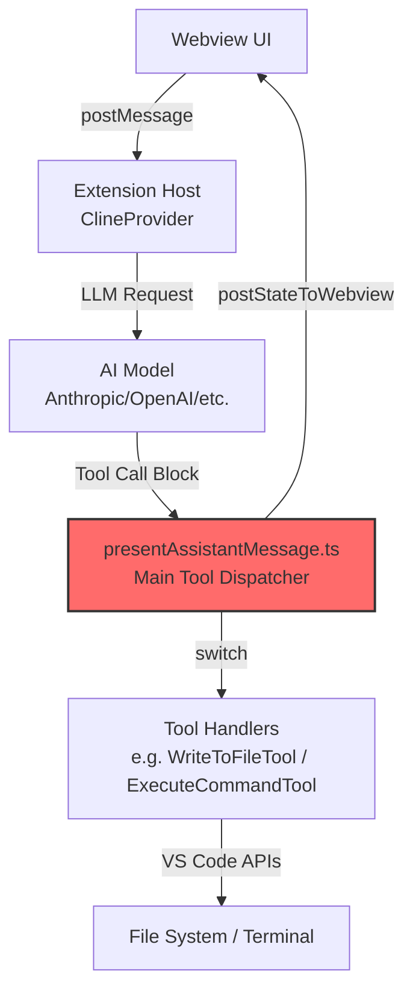
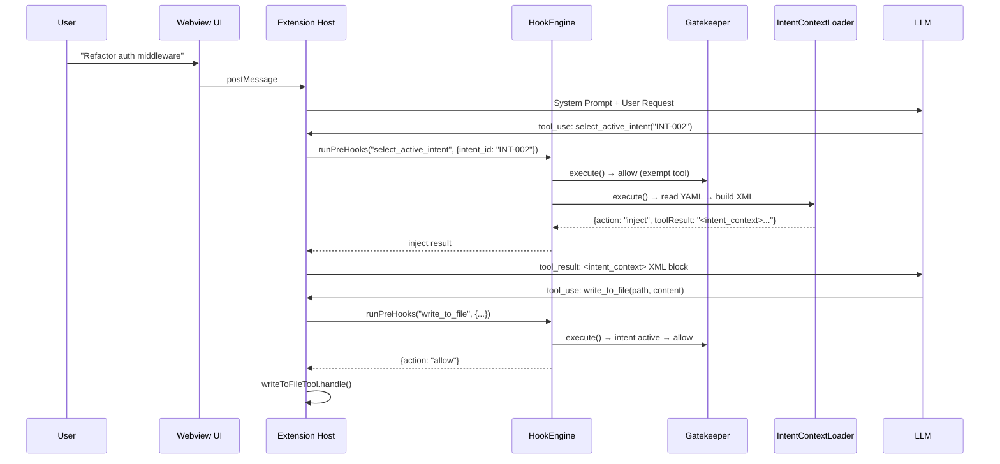

# ARCHITECTURE_NOTES.md – Phase 0: Archaeological Dig Results

**TRP1 Challenge Week 1 – Architecting the AI-Native IDE & Intent-Code Traceability**  
_Findings from Roo Code (fork: <https://github.com/Birkity/Roo-Code>)_  
_Date: February 18, 2026_

## Executive Summary – Phase 0 Status

**Objective achieved**: Successfully mapped the critical execution pathways of Roo Code (tool loop, prompt construction, Webview ↔ Extension Host communication, conversation pipeline).  
Identified precise hook injection points for Phase 1 (Handshake) and Phase 2 (Hook Engine).  
Roo Code demonstrates **production-grade architecture** — monorepo with Clean Architecture layers, strong type safety, event-driven design, and built-in approval gates — providing an excellent foundation for intent traceability and governance.

## 1. Core Extension Architecture

### Main Entry Points

- **Activation file**: `src/extension.ts`  
  Registers the sidebar provider and activation events.
- **Primary provider**: `src/core/webview/ClineProvider.ts`  
  Implements `vscode.WebviewViewProvider` — controls sidebar lifecycle and state.

### Activation Flow (simplified)

```typescript
// src/extension.ts (~line 323)
context.subscriptions.push(
	vscode.window.registerWebviewViewProvider(ClineProvider.sideBarId, provider, {
		webviewOptions: { retainContextWhenHidden: true },
	}),
)
```

## 2. Tool Execution System – Critical for Hooks

### Tool Definitions

Location: `src/shared/tools.ts`  
Defines strongly-typed tool interfaces (e.g., `write_to_file`, `execute_command`).

Example:

```typescript
export interface WriteToFileToolUse extends ToolUse<"write_to_file"> {
	name: "write_to_file"
	params: { path: string; content: string }
}
```

### Central Tool Dispatcher – MAIN HOOK TARGET

Location: `src/core/assistant-message/presentAssistantMessage.ts`  
This is **the primary tool execution loop**.

Key pattern:

```typescript
switch (block.name) {
	case "execute_command":
		await executeCommandTool.handle(cline, block, { askApproval, handleError, pushToolResult })
		break
	case "write_to_file":
		await writeToFileTool.handle(cline, block, { askApproval, handleError, pushToolResult })
		break
}
```

### Tool Handlers

- `src/core/tools/ExecuteCommandTool.ts` → runs shell commands via VS Code terminal
- `src/core/tools/WriteToFileTool.ts` → writes/modifies files (with diff preview + approval)

**Hook opportunities identified**:

- **Pre-hook**: Before `.handle()` call (validate intent, scope, HITL)
- **Post-hook**: After successful execution (log trace, compute hash, format/lint)

## 3. System Prompt Generation – Critical for Reasoning Enforcement

### Main Builder Locations

- Entry: `src/core/webview/generateSystemPrompt.ts`
- Core function: `src/core/prompts/system.ts` → `SYSTEM_PROMPT()`
- Modular sections: `src/core/prompts/sections/`

### Prompt Construction Flow

```typescript
export const generateSystemPrompt = async (provider: ClineProvider, message: WebviewMessage) => {
	const systemPrompt = await SYSTEM_PROMPT(
		provider.context,
		cwd,
		mcpEnabled ? provider.getMcpHub() : undefined,
		diffStrategy,
		mode,
		customModePrompts,
		customInstructions,
		// ... other dynamic parts
	)
}
```

**Injection points for Phase 1**:

- `customInstructions`
- `customModePrompts`
- Add new param `intentContext` → inject `<intent_context>` block

## 4. Webview ↔ Extension Host Communication

### Pattern

- **Frontend**: `webview-ui/` (React, no Node.js access)
- **Backend**: `src/core/webview/ClineProvider.ts`
- **IPC**: `postMessage` ↔ `onDidReceiveMessage`

### Central Handler

`src/core/webview/webviewMessageHandler.ts` — dispatches all incoming messages from UI.

**Phase 1 opportunity**: Add new message types (`analyzeIntent`, `selectActiveIntent`).

## 5. LLM Conversation Pipeline – Full Flow

1. User input → `webviewMessageHandler` → `Task.handleWebviewAskResponse()`
2. `Task.start()` → LLM request via provider
3. Response → `presentAssistantMessage()` → tool execution switch
4. Tool result → `postStateToWebview()` → UI update

Key class: `src/core/task/Task.ts` — manages state, history, tools.

Persistence: `.roo/tasks/{taskId}/` (we will extend to `.orchestration/`).

## 6. High-Level Execution Flow Diagram




**Highlighted**: `presentAssistantMessage.ts` — primary target for tool interception.

## 7. Key Findings Summary – Phase 0 Targets

| Requirement                                | Location Found                                                             | Notes / Hook Potential                   |
| ------------------------------------------ | -------------------------------------------------------------------------- | ---------------------------------------- |
| Tool loop (execute_command, write_to_file) | `src/core/assistant-message/presentAssistantMessage.ts`                    | Main switch → ideal Pre/Post hook points |
| Tool handlers                              | `src/core/tools/*.ts`                                                      | Individual `.handle()` methods           |
| System prompt builder                      | `src/core/webview/generateSystemPrompt.ts`<br>`src/core/prompts/system.ts` | Inject intent rules here                 |
| Webview ↔ Host communication              | `src/core/webview/webviewMessageHandler.ts`                                | Add intent selection messages            |
| Conversation / task management             | `src/core/task/Task.ts`                                                    | Extend with intent metadata              |

## 8. Strategic Observations

- Roo Code already has approval gates (`askApproval`) → perfect for HITL enforcement
- Existing event-driven design (EventEmitter) → ideal for HookEngine
- Strong type system (`@roo-code/types`) → extend for `IntentMetadata`
- Production-grade patterns → easy to add clean, maintainable hooks

---

## 9. Phase 1 Overview

Phase 1 implements the **Reasoning Loop** ("Handshake") — a two-stage state machine that forces the AI agent to declare a business intent before performing any mutating operations.

**The Problem Solved**: Without the Handshake, the AI agent can immediately modify files upon receiving a user request, with no traceability to business requirements ("vibe coding").

**The Solution**: A `select_active_intent(intent_id)` tool + HookEngine middleware that:

1. Blocks all mutating tools until an intent is declared
2. Reads `.orchestration/active_intents.yaml` for intent context
3. Injects constraints, scope, and acceptance criteria into the conversation
4. Enforces the protocol via system prompt + runtime gatekeeper

## 10. New Tool: `select_active_intent`

### Tool Registration

The tool was added across the full Roo Code tool registration pipeline:

| File Modified                                                 | Change                                                                                                     |
| ------------------------------------------------------------- | ---------------------------------------------------------------------------------------------------------- |
| `packages/types/src/tool.ts`                                  | Added `"select_active_intent"` to canonical `toolNames` array                                              |
| `src/shared/tools.ts`                                         | Added `NativeToolArgs`, `ToolUse` interface, param name `intent_id`, display name, ALWAYS_AVAILABLE status |
| `src/core/prompts/tools/native-tools/select_active_intent.ts` | New — JSON Schema (OpenAI format) for LLM tool calling                                                     |
| `src/core/prompts/tools/native-tools/index.ts`                | Registered in `getNativeTools()` array                                                                     |

### Tool Schema (sent to LLM)

```typescript
{
  type: "function",
  function: {
    name: "select_active_intent",
    description: "Declare which business intent you are working on...",
    strict: true,
    parameters: {
      type: "object",
      properties: {
        intent_id: { type: "string", description: "The unique identifier..." }
      },
      required: ["intent_id"],
      additionalProperties: false
    }
  }
}
```

## 11. Hook Engine Architecture (`src/hooks/`)

### Directory Structure

```
src/hooks/
├── index.ts                 # Public API re-exports
├── types.ts                 # Shared types (HookContext, PreHookResult, IntentEntry, etc.)
├── HookEngine.ts            # Central middleware orchestrator
├── IntentContextLoader.ts   # Pre-hook: handles select_active_intent
└── PreToolHook.ts           # Gatekeeper: blocks mutating tools without intent
```

### Design Principles

1. **Composable** — Hooks are registered as ordered arrays; new hooks can be added without modifying existing ones
2. **Non-intrusive** — The engine wraps existing tool execution; it does not replace or patch tool handlers
3. **Fail-safe** — If a hook throws, the error is captured and returned as a `tool_result` error

### The HookEngine Class

```typescript
class HookEngine {
  private readonly preHooks: Array<(ctx: HookContext) => Promise<PreHookResult>>
  private _activeIntentId: string | null = null
  private _intentContextXml: string | null = null

  constructor(cwd: string) {
    this.preHooks = [
      (ctx) => GatekeeperHook.execute(ctx, this),      // Priority 1: Validate intent
      (ctx) => IntentContextLoader.execute(ctx, this),   // Priority 2: Load context
    ]
  }

  async runPreHooks(toolName, params): Promise<PreHookResult> { ... }
}
```

**Instantiation**: Created in `Task.ts` constructor → `this.hookEngine = new HookEngine(this.cwd)`

### Integration Point — `presentAssistantMessage.ts`

The HookEngine is invoked **before** the tool dispatch `switch` statement:

```typescript
// Line ~678 in presentAssistantMessage.ts
if (!block.partial) {
  const hookResult = await cline.hookEngine.runPreHooks(
    block.name,
    (block.nativeArgs as Record<string, unknown>) ?? block.params ?? {},
  )

  if (hookResult.action === "block" || hookResult.action === "inject") {
    pushToolResult(
      hookResult.action === "block"
        ? formatResponse.toolError(hookResult.toolResult)
        : hookResult.toolResult,
    )
    break
  }
}

switch (block.name) { ... }  // Original switch — only reached if hooks allow
```

## 12. Pre-Hook 1: Gatekeeper (`PreToolHook.ts`)

### Decision Tree

```
Is tool exempt? (read_file, select_active_intent, etc.)
  → YES → Allow
  → NO → Is intent active?
           → YES → Allow
           → NO → BLOCK: "You must cite a valid active Intent ID before any tool use."
```

### Tool Classification

| Category      | Tools                                                              | Intent Required?                       |
| ------------- | ------------------------------------------------------------------ | -------------------------------------- |
| **Mutating**  | `write_to_file`, `apply_diff`, `edit`, `execute_command`, etc.     | YES                                    |
| **Read-only** | `read_file`, `list_files`, `search_files`, `codebase_search`       | NO                                     |
| **Meta**      | `ask_followup_question`, `attempt_completion`, `switch_mode`, etc. | NO                                     |
| **Handshake** | `select_active_intent`                                             | NO (exempt to avoid circular blocking) |

## 13. Pre-Hook 2: IntentContextLoader (`IntentContextLoader.ts`)

### Execution Flow

1. Only activates for `select_active_intent` tool calls
2. Reads `.orchestration/active_intents.yaml` using the `yaml` package
3. Finds matching intent by ID
4. Builds `<intent_context>` XML block with constraints, scope, and criteria
5. Returns XML as `tool_result` → AI sees it in next turn

### XML Context Block (example output)

```xml
<intent_context>
  <intent id="INT-001" name="JWT Authentication Migration" status="IN_PROGRESS">
    <constraints>
      <constraint>Must not use external auth providers</constraint>
      <constraint>Must maintain backward compatibility with Basic Auth</constraint>
    </constraints>
    <owned_scope>
      <path>src/auth/**</path>
      <path>src/middleware/jwt.ts</path>
    </owned_scope>
    <acceptance_criteria>
      <criterion>Unit tests in tests/auth/ pass</criterion>
    </acceptance_criteria>
  </intent>
  <instruction>
    You are now operating under Intent "INT-001: JWT Authentication Migration".
    You MUST respect all constraints. You may ONLY modify files matching owned_scope.
  </instruction>
</intent_context>
```

## 14. System Prompt Injection (`intent-protocol.ts`)

A new prompt section was added to `src/core/prompts/sections/intent-protocol.ts` and integrated into `system.ts` via `getIntentProtocolSection()`.

Key instruction injected:

> "You are an Intent-Driven Architect. You CANNOT write code or call any mutating tool immediately. Your first action MUST be to analyze the user request and call `select_active_intent(intent_id)` to load the necessary context."

This provides **probabilistic enforcement** (LLM follows instructions) while the Gatekeeper provides **deterministic enforcement** (runtime blocking).

## 15. Data Model: `.orchestration/active_intents.yaml`

Example file created at `.orchestration/active_intents.yaml` with three intents:

- `INT-001`: JWT Authentication Migration (IN_PROGRESS)
- `INT-002`: Refactor Auth Middleware (IN_PROGRESS)
- `INT-003`: Build Weather API Endpoint (DRAFT)

## 16. Phase 1 Execution Flow Diagram



## 17. How to Test Phase 1

### Manual Testing in Extension Host

1. **Launch the Extension Host** (`F5` in VS Code)
2. Ensure `.orchestration/active_intents.yaml` exists in the test workspace
3. Open the Roo Code sidebar chat panel

### Test Case 1: Happy Path (Handshake succeeds)

```
User: "Refactor the auth middleware"
Expected:
  → AI calls select_active_intent("INT-002")
  → Tool result returns <intent_context> XML
  → AI then uses mutating tools (write_to_file, etc.) within scope
```

### Test Case 2: Gatekeeper blocks (no intent declared)

```
User: "Write a hello world file"
Expected (if AI skips handshake):
  → AI calls write_to_file(...)
  → Gatekeeper BLOCKS with error:
    "You must cite a valid active Intent ID before any tool use."
  → AI self-corrects and calls select_active_intent first
```

### Test Case 3: Invalid intent ID

```
User triggers select_active_intent("INT-999")
Expected:
  → IntentContextLoader returns error with list of available intents
  → AI self-corrects with valid ID
```

### Test Case 4: Missing YAML file

```
Delete .orchestration/active_intents.yaml
User: "Do some work"
Expected:
  → IntentContextLoader returns error:
    "File not found: .orchestration/active_intents.yaml"
  → AI asks user to create the file
```

---

## Phase 2: Security Classification & Post-Edit Automation

**Objective**: Add security guardrails and quality enforcement to the hook pipeline. Every tool call is risk-classified, destructive operations require human approval, file writes are scope-checked, and modified files are auto-formatted/linted.

### 2.1 Component Inventory

| File                    | Purpose                                                         | Lines |
| ----------------------- | --------------------------------------------------------------- | ----- |
| `CommandClassifier.ts`  | Risk-tier classification (SAFE / DESTRUCTIVE / CRITICAL / META) | 228   |
| `AuthorizationGate.ts`  | UI-blocking human-in-the-loop modal for risky operations        | 260   |
| `PostToolHook.ts`       | Post-edit Prettier + ESLint auto-formatting                     | 310   |
| `ScopeEnforcer.ts`      | Glob-based owned-scope enforcement for file writes              | 206   |
| `AutonomousRecovery.ts` | Self-correction error formatting on rejection                   | 229   |

### 2.2 Command Classification (`CommandClassifier.ts`)

Classifies every tool call into one of four risk tiers:

- **SAFE** — Read-only operations (`read_file`, `list_files`, `search_files`)
- **DESTRUCTIVE** — Write/delete operations (`write_to_file`, `apply_diff`)
- **CRITICAL** — High-risk terminal commands (`rm -rf`, `git push --force`)
- **META** — Conversation control tools (`ask_followup_question`, `attempt_completion`)

Uses static tool-name mapping plus regex pattern matching for `execute_command` payloads.

### 2.3 Authorization Gate (`AuthorizationGate.ts`)

Implements the HITL (Human-in-the-Loop) boundary:

1. SAFE/META operations → auto-approved
2. DESTRUCTIVE operations → VS Code warning modal with Approve/Reject
3. CRITICAL operations → VS Code warning modal showing the matched dangerous pattern
4. `.intentignore` support for bypassing checks on trusted intents

The Promise chain is **paused indefinitely** until the user clicks Approve or Reject — this is the "impenetrable defense against runaway execution loops."

### 2.4 Post-Edit Formatting (`PostToolHook.ts`)

Fires AFTER a tool successfully executes:

1. Detects the modified file path from tool params
2. Runs Prettier on the file
3. Runs ESLint on the file
4. If errors → appends feedback to the next `tool_result` for self-correction
5. If clean → logs success

### 2.5 Scope Enforcement (`ScopeEnforcer.ts`)

Validates that file-write targets fall within the active intent's `owned_scope` glob patterns. Uses the `picomatch` algorithm for glob matching. Out-of-scope writes are blocked immediately with a structured scope violation error.

### 2.6 Autonomous Recovery (`AutonomousRecovery.ts`)

When AuthorizationGate rejects an operation, formats a standardized JSON `tool_result` error so the LLM can self-correct rather than crash or infinite-loop. Recovery guidance includes: acknowledging the rejection, analyzing the violated constraint, and proposing a safe alternative.

### 2.7 Test Coverage

| Test File                    | Tests |
| ---------------------------- | ----- |
| `ScopeEnforcer.test.ts`      | 13    |
| `AutonomousRecovery.test.ts` | 6     |
| `PostToolHook.test.ts`       | 18    |
| `CommandClassifier.test.ts`  | 18    |
| `AuthorizationGate.test.ts`  | 13    |

---

## Phase 3: Traceability & Semantic Classification

**Objective**: Implement the "golden thread" linking every code change back to its originating requirement via Agent Trace records, content hashing, and mutation classification.

### 3.1 Component Inventory

| File                    | Purpose                                                  | Lines |
| ----------------------- | -------------------------------------------------------- | ----- |
| `HashUtils.ts`          | SHA-256 content hashing with normalization               | ~180  |
| `SemanticClassifier.ts` | Weighted scoring model: AST_REFACTOR vs INTENT_EVOLUTION | 315   |
| `TraceLogger.ts`        | Agent Trace record builder + JSONL sidecar persistence   | 288   |

### 3.2 Content Hashing (`HashUtils.ts`)

- `hashFile(content)` — SHA-256 of normalized file content
- `hashRange(content, startLine, endLine)` — Hash a specific line range (spatial independence)
- `verify(content, hash)` — Check content against a stored hash
- `normalizeContent(content)` — CRLF→LF, trim trailing whitespace, remove trailing newlines

All hashes are prefixed with `sha256:` for forward-compatible algorithm identification.

### 3.3 Semantic Classification (`SemanticClassifier.ts`)

Weighted mathematical scoring model:

$$\text{Score} = w_1 \cdot \Delta\text{Imports} + w_2 \cdot \Delta\text{Exports} + w_3 \cdot \Delta\text{Signatures} + w_4 \cdot \Delta\text{LineCount} + w_5 \cdot \text{NewSymbols}$$

- Score >= 0.35 → `INTENT_EVOLUTION` (new feature/behavior)
- Score < 0.35 → `AST_REFACTOR` (intent-preserving refactor)

Also supports `classifyWithOverride()` for agent-provided classification with agreement tracking.

### 3.4 Agent Trace Logger (`TraceLogger.ts`)

Builds Agent Trace records per the `agent-trace.dev` spec:

1. Captures `vcs.revision_id` from current Git SHA
2. Computes before/after content hashes
3. Injects the active Requirement ID into the `related` field (the "golden thread")
4. Classifies the mutation via `SemanticClassifier`
5. Appends the record as a line to `.orchestration/agent_trace.jsonl`

### 3.5 Integration with HookEngine

TraceLogger fires in the **PostToolUse** pipeline:

- After a file-modifying tool executes successfully
- Captures the before/after state and writes a trace record
- The trace links back to the active intent's requirement ID

### 3.6 Test Coverage

| Test File                    | Tests |
| ---------------------------- | ----- |
| `HashUtils.test.ts`          | 11    |
| `SemanticClassifier.test.ts` | 14    |
| `TraceLogger.test.ts`        | 20    |

---

## Phase 4: Multi-Agent Concurrency & Context Management

**Objective**: Extend the Hook Engine to support parallel agent orchestration with concurrency-safe file operations, AST-aware patching, context compaction, hierarchical sub-agent management, and persistent lesson recording.

### 4.1 Architecture Overview

```
Phase 4 Integration Flow (inside HookEngine)

  ┌─────────────────┐
  │   Pre-Hook       │
  │ (runPreHooks)    │
  │                  │
  │ 1. Gatekeeper    │──── Phase 1: Intent validation
  │ 2. Security      │──── Phase 2: Classification + AuthZ + Scope
  │ 3. Concurrency   │──── Phase 4: OptimisticLock + AstPatchValidator
  └────────┬─────────┘
           │
           ▼
  ┌─────────────────┐
  │   Tool Executes  │──── Roo Code processes the tool call
  └────────┬─────────┘
           │
           ▼
  ┌─────────────────┐
  │   Post-Hook      │
  │ (runPostHooks)   │
  │                  │
  │ 1. Format+Lint   │──── Phase 2: PostToolHook (Prettier/ESLint)
  │ 2. Trace         │──── Phase 3: TraceLogger + SemanticClassifier
  │ 3. Lessons       │──── Phase 4: LessonRecorder (lint → CLAUDE.md)
  │ 4. Lock Update   │──── Phase 4: updateLockAfterWrite
  └─────────────────┘
```

### 4.2 Component Inventory

| File                        | Purpose                                          | Pattern                            |
| --------------------------- | ------------------------------------------------ | ---------------------------------- |
| `OptimisticLock.ts`         | Hash-based concurrency control                   | Stateful (per HookEngine instance) |
| `AstPatchValidator.ts`      | Block full-file rewrites, enforce targeted diffs | Static utility                     |
| `LessonRecorder.ts`         | Persist lessons to CLAUDE.md shared brain        | Static utility                     |
| `ContextCompactor.ts`       | Prevent context rot via summarization            | Static utility                     |
| `SupervisorOrchestrator.ts` | Hierarchical sub-agent orchestration             | Stateful                           |

### 4.3 Optimistic Locking (`OptimisticLock.ts`)

**Purpose**: Detect concurrent file modifications in multi-agent environments.

**Algorithm**:

1. When agent reads a file → `captureReadHash(path)` stores SHA-256 baseline
2. When agent writes a file → `validateWrite(path)` re-hashes disk content
3. If baseline ≠ current → **BLOCK** write with `STALE_FILE` error
4. After successful write → `updateAfterWrite(path)` refreshes baseline

**Key Design Decisions**:

- Ring buffer of 10 snapshots per file (supports multi-agent snapshot stacking)
- Agent-scoped snapshot matching via optional `agentId`
- Non-blocking for concurrent readers (optimistic, not pessimistic)
- Structured XML error feedback via `formatStaleFileError()`

**Integration Point**: `HookEngine.runPhase4ConcurrencyControl()` calls `validateWrite` in the pre-hook pipeline for all mutating tool calls.

### 4.4 AST-Aware Patch Validation (`AstPatchValidator.ts`)

**Purpose**: Force agents to emit targeted patches instead of full-file rewrites.

**Strategy**:

- `computeChangeRatio()` — O(n) line-set comparison between old/new content
- If change ratio > **60%** on files with **≥15 lines** → block as `FULL_REWRITE`
- `extractSymbols()` — Regex-based AST symbol detection (functions, classes, interfaces)
- `identifyChangedSymbols()` — Diffs old vs new symbol sets for structural guidance
- `parseUnifiedDiff()` — Validates `@@ -a,b +c,d @@` hunk format for `apply_diff`

**Validated Tools**: `write_to_file`, `apply_diff`, `edit`, `search_and_replace`, `search_replace`, `edit_file`, `apply_patch`

**Always Allowed**: New file creation, search-and-replace (inherently targeted), small files (<15 lines)

### 4.5 Lesson Recording (`LessonRecorder.ts`)

**Purpose**: Persist "lessons learned" to `CLAUDE.md` — the shared brain file.

**Trigger Points**:

- Lint failure → `recordLintFailure()` extracts ESLint rule names
- Test failure → `recordTestFailure()` captures stderr
- Scope violation → `recordScopeViolation()` logs owned scope boundaries
- Lock conflict → `recordLockConflict()` logs baseline/current hash divergence
- Architectural decision → `recordArchitecturalDecision()` (manual agent recording)

**File Management**:

- Auto-creates `CLAUDE.md` with template structure if absent
- Appends to `## Lessons Learned` section
- Auto-prunes to 200 lessons maximum (removes oldest)

**Integration Point**: `HookEngine.recordLintLessonIfNeeded()` calls `LessonRecorder.recordLintFailure()` in the post-hook pipeline after PostToolHook reports lint errors.

### 4.6 Context Compaction (`ContextCompactor.ts`)

**Purpose**: Prevent "Context Rot" by summarizing older conversation turns before the context window overflows.

**Key Methods**:

- `truncateToolOutput(output, maxLength)` — Preserves head (60%) + tail (20%) with truncation marker
- `compact(turns, config)` — Splits conversation into old (summarized) + recent (preserved verbatim)
- `summarizeTurns(turns, maxLength)` — Role-aware bullet-point summary (`[User]`, `[Agent]`, `[Result]`, `[System]`)
- `prepareSubAgentContext(taskSpec, files, parentTurns, intent, cwd)` — Builds narrow context for sub-agent spawn
- `estimateTokens(turns)` — Heuristic: 4 chars ≈ 1 token

**Default Configuration**:

- `maxTokenBudget`: 120,000 tokens
- `maxToolOutputLength`: 3,000 chars
- `preserveRecentTurns`: 6 (verbatim preservation)
- `maxSummaryLength`: 2,000 chars
- `exportStateToTaskFile`: true (persists state to `.orchestration/TASKS.md` before compaction)

### 4.7 Supervisor Orchestration (`SupervisorOrchestrator.ts`)

**Purpose**: Implements the hierarchical Manager → Worker pattern for multi-agent coordination.

**Agent Roles** (enum `AgentRole`):

- `ARCHITECT` — Plans decomposition, owns no code
- `BUILDER` — Implements features in assigned scope
- `TESTER` — Writes and runs tests
- `REVIEWER` — Reviews diffs for quality
- `DOCUMENTER` — Updates documentation

**Sub-Task Lifecycle**:

1. `createSubTask(description, role, scope)` → `PENDING`
2. `prepareSubTask(id, parentTurns, intent)` → `IN_PROGRESS` (builds `SubAgentContext`)
3. Sub-agent executes autonomously within assigned scope
4. `completeSubTask(id, payload)` → `COMPLETED` or `FAILED`

**Write Partitioning**:

- `validateScopePartitioning()` — Detects scope overlaps between sub-tasks
- `findScopeOverlap(scopeA, scopeB)` — Prefix-based containment check
- Mathematically eliminates spatial conflicts by assigning disjoint file scopes

**Execution Order**:

- `getExecutionOrder()` — Topological sort with priority-based tie-breaking
- Dependency-aware: task B waits for task A's completion before starting

**State Persistence**:

- Saves to `.orchestration/orchestration_state.json` after every mutation
- `loadState(cwd)` — Recovers state for session continuation

### 4.8 Test Coverage

| Test File                        | Tests   | Covers                                                                                                                        |
| -------------------------------- | ------- | ----------------------------------------------------------------------------------------------------------------------------- |
| `OptimisticLock.test.ts`         | 23      | Hash capture, validation (match/mismatch/deleted), agent-scoped matching, ring buffer, clear, normalization, error formatting |
| `AstPatchValidator.test.ts`      | 25      | Full-rewrite detection, new file, targeted diff, search-replace, change ratio, symbol extraction, diff parsing                |
| `LessonRecorder.test.ts`         | 17      | Formatting, recording, brain file creation, convenience methods, category enum                                                |
| `ContextCompactor.test.ts`       | 25      | Truncation, token estimation, summarization, compaction, sub-agent context                                                    |
| `SupervisorOrchestrator.test.ts` | 30      | Sub-task CRUD, dependency blocking, scope partitioning, execution order, status reporting, state persistence                  |
| **Total**                        | **120** | Full Phase 4 coverage                                                                                                         |

### 4.9 `index.ts` Public API (Phase 4 Exports)

```typescript
// ── Phase 4 ──────────────────────────────────────────────────────────────
export { OptimisticLockManager } from "./OptimisticLock"
export type { FileHashSnapshot, LockValidationResult } from "./OptimisticLock"

export { AstPatchValidator, PatchType } from "./AstPatchValidator"
export type { PatchValidationResult, PatchTarget, DiffHunk } from "./AstPatchValidator"

export { LessonRecorder, LessonCategory } from "./LessonRecorder"
export type { LessonEntry, LessonResult } from "./LessonRecorder"

export { ContextCompactor } from "./ContextCompactor"
export type { ConversationTurn, CompactionConfig, CompactionResult, SubAgentContext } from "./ContextCompactor"

export { SupervisorOrchestrator, AgentRole, SubTaskStatus } from "./SupervisorOrchestrator"
export type { SubTask, SubTaskCompletionPayload, OrchestrationState } from "./SupervisorOrchestrator"
```
